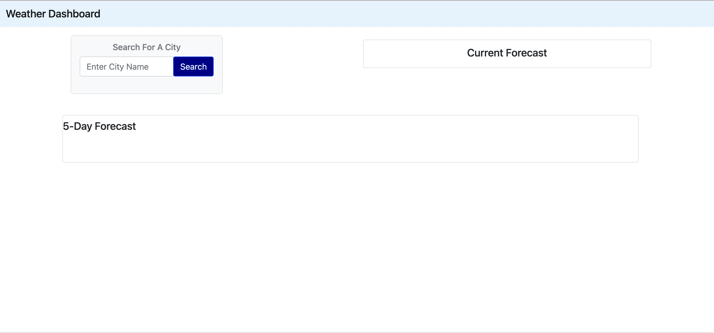
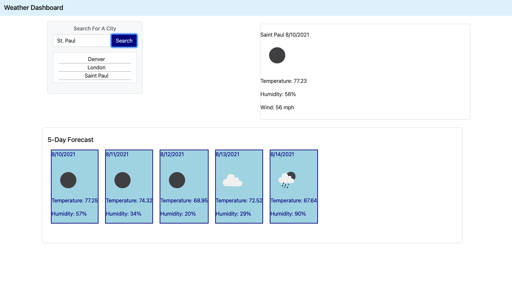

# WeatherDashBoard-hw

## Description:

The motivation behind creating this web application is to give the user the ablility to view the weather in a certain location. Additionally, the application has teh functionality to look up weather data for the current date and a glimpse of the next 5 day forcast. The application is able to pull in weather data for Humity, Wind, Temp, and the current date. The application saves search history to allow the see their recent searches. The app gathers data from an API - openweathermap.org. I was able to learn a lot from the application escpically pulling in data from a third-party API. I learned that when working with API keys you might have to wait a while for the key to work and that imperial is used for the US in terms of units for the particular API that I used in this application. Additionally, I learned how to use jQuery to convert the data into a readable date for the user. The most challenging peice of the application to build was pulling in the icons from the API. Unfortuantely, I was unable to pull in the uv index into the application.

## Instalation:

Browser and Internet Access are that are needed to deploy this application

## Usage

Steps:

-Load the application into the browser
-The user will be brought to the following page:

-The user will then have to type in a City Name and the screen with populate with that cities weather data (Temp, Humidity, Wind and date). The box to the left will have the current weather conditions and the bottom will have the weather for the following 5 days.

-Additionally, under the seach bar the users recent searcheed will be displayed.

## Credits

API- openWeathermap.org - all data credit to OpenWeather (TM)
Jquery - https://api.jquery.com/
BootStrap - Code licensed MIT, docs CC BY 3.0. - https://getbootstrap.com/

Additonally used: HTML & CSS.

Link to deployed Website:
https://adrianauch.github.io/WeatherDashBoard-hw/
